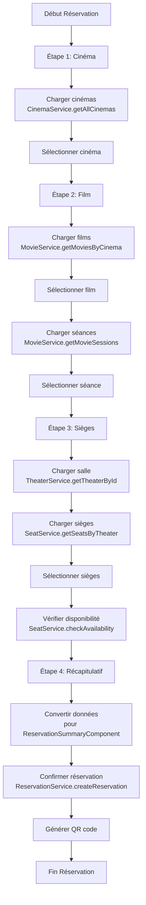

# Plan de Mise à Jour du Composant ReservationFlowComponent

## Contexte
Le composant [`ReservationFlowComponent`](src/app/shared/components/organisms/reservation-flow/reservation-flow.component.ts) actuel ne respecte pas le processus métier cible. Ce plan détaille la refonte complète pour aligner le composant avec les étapes métier et l'intégration API.

## Processus Cible
1. **Sélection cinéma**
2. **Sélection film + affichage séances**
3. **Choix sièges + calcul prix**
4. **Récapitulatif via [`ReservationSummaryComponent`](src/app/shared/components/molecules/reservation-summary/reservation-summary.component.ts) + validation**

## Services API Disponibles

### Services Existants à Utiliser
- **`CinemaService`** - Gestion des cinémas
- **`MovieService`** - Gestion des films et séances
- **`ShowtimeService`** - Gestion des séances
- **`TheaterService`** - Gestion des salles
- **`ReservationService`** - Gestion des réservations (existant)
- **`SeatsService`** - Gestion des sièges et disponibilités (existant)

### Méthodes Clés des Services
- **`CinemaService.getAllCinemas()`** - Liste des cinémas
- **`MovieService.getMoviesByCinema(cinemaId)`** - Films par cinéma
- **`MovieService.getMovieSessions(movieId)`** - Séances par film
- **`ShowtimeService.getAllShowtimes()`** - Toutes les séances
- **`TheaterService.getTheaterById(theaterId)`** - Détails salle
- **`SeatsService.getTheaterSeats(theaterId)`** - Sièges par salle
- **`SeatsService.getAvailableSeats(sessionId)`** - Sièges disponibles
- **`ReservationService.createReservation(reservationData)`** - Créer réservation
- **`ReservationService.getAvailableSeats(showtimeId)`** - Vérifier disponibilité

## Interfaces Core à Utiliser

### Interfaces Principales
- **`CinemaDto`** (ligne 261) - Données cinéma
- **`MovieDto`** (ligne 133) - Données film
- **`ShowtimeDto`** (ligne 188) - Données séance
- **`TheaterDto`** (ligne 276) - Données salle
- **`SeatDto`** (ligne 206) - Données siège
- **`CreateReservationDto`** (ligne 673) - Création réservation

## Nouvelle Architecture du Composant

### Étape 1 : Sélection Cinéma

#### Composants Réutilisables
- **`CinemaCardComponent`** (existant) - Carte cinéma avec détails
- **`SelectComponent`** (existant) - Liste déroulante alternative
- **`ButtonComponent`** (existant) - Navigation
- **`BadgeComponent`** (existant) - Indicateurs statut
- **`IconComponent`** (existant) - Icônes équipements

#### Services Utilisés
- **`CinemaService.getAllCinemas()`** - Récupération liste cinémas

#### Interface de Données
```typescript
interface CinemaSelectionData {
  cinema: CinemaDto;
}
```

#### Validation
- Un cinéma doit être sélectionné

---

### Étape 2 : Sélection Film + Séances

#### Composants Réutilisables
- **`FilmCardComponent`** (existant) - Carte film avec affiche
- **`ShowtimeSelectorComponent`** (existant) - Sélecteur d'horaires complet
- **`BadgeComponent`** (existant) - Indicateurs genre/âge/disponibilité
- **`IconComponent`** (existant) - Icônes qualité projection/accessibilité
- **`ButtonComponent`** (existant) - Sélection

#### Services Utilisés
- **`MovieService.getMoviesByCinema(cinemaId)`** - Films par cinéma
- **`MovieService.getMovieSessions(movieId)`** - Séances par film
- **`ShowtimeService.getAllShowtimes()`** - Toutes les séances

#### Interface de Données
```typescript
interface MovieSelectionData {
  movie: MovieDto;
  showtime: ShowtimeDto;
  theater: TheaterDto;
}
```

#### Validation
- Un film et une séance doivent être sélectionnés

---

### Étape 3 : Choix Sièges + Calcul Prix

#### Composants Réutilisables
- **`SeatSelectionGridComponent`** (existant) - Grille de sièges interactive complète
- **`SeatGridComponent`** (existant) - Alternative grille sièges
- **`SeatComponent`** (existant) - Composant siège individuel
- **`SeatLegendComponent`** (existant) - Légende types de sièges
- **`SeatCounterComponent`** (existant) - Compteur et prix
- **`BadgeComponent`** (existant) - Indicateurs disponibilité

#### Services Utilisés
- **`TheaterService.getTheaterById(theaterId)`** - Détails salle
- **`SeatsService.getTheaterSeats(theaterId)`** - Sièges par salle
- **`SeatsService.getAvailableSeats(sessionId)`** - Sièges disponibles
- **`ReservationService.getAvailableSeats(showtimeId)`** - Vérification disponibilité

#### Interface de Données
```typescript
interface SeatSelectionData {
  selectedSeats: SeatDto[];
  totalAmount: number;
  seatTypes: {
    standard: number;
    premium: number;
    handicap: number;
  };
}
```

#### Validation
- Au moins un siège doit être sélectionné
- Vérification disponibilité en temps réel

---

### Étape 4 : Récapitulatif + Validation

#### Composants Réutilisables
- **`ReservationSummaryComponent`** (existant) - Affichage récapitulatif complet
- **`QRCodeComponent`** (existant) - Génération QR code
- **`ButtonComponent`** (existant) - Actions confirmation/modification
- **`BadgeComponent`** (existant) - Statut réservation
- **`IconComponent`** (existant) - Icônes actions

#### Services Utilisés
- **`ReservationService.createReservation(reservationData)`** - Création réservation
- **`ReservationService.cancelReservation(reservationId)`** - Annulation

#### Interface de Données
```typescript
interface ReservationSummaryData {
  reservation: UserReservationDto;
  canModify: boolean;
  canCancel: boolean;
}
```

#### Actions Disponibles
- **Confirmer** - Finalise la réservation
- **Modifier** - Retour à l'étape précédente
- **Annuler** - Annule le processus

## Modifications Requises sur ReservationFlowComponent

### 1. Nouvelles Interfaces
```typescript
export interface ReservationFlowData {
  cinema: CinemaDto;
  movie: MovieDto;
  showtime: ShowtimeDto;
  theater: TheaterDto;
  selectedSeats: SeatDto[];
  totalAmount: number;
  reservationId?: string;
}
```

### 2. Nouvelles Étapes
```typescript
steps: ReservationStep[] = [
  {
    id: 'cinema-selection',
    title: 'Sélection du cinéma',
    description: 'Choisissez votre cinéma',
    completed: false,
    active: true
  },
  {
    id: 'movie-selection', 
    title: 'Film et séance',
    description: 'Choisissez votre film et horaire',
    completed: false,
    active: false
  },
  {
    id: 'seat-selection',
    title: 'Sélection des sièges',
    description: 'Choisissez vos places',
    completed: false,
    active: false
  },
  {
    id: 'summary',
    title: 'Récapitulatif',
    description: 'Vérifiez et confirmez',
    completed: false,
    active: false
  }
];
```

### 3. Intégration Services
```typescript
// Dans le constructeur
private cinemaService = inject(CinemaService);
private movieService = inject(MovieService);
private showtimeService = inject(ShowtimeService);
private theaterService = inject(TheaterService);
private seatService = inject(SeatService);
private reservationService = inject(ReservationService);
```

## Workflow d'Intégration API



## Composants Disponibles et Réutilisables

### Composants Atoms Réutilisables
- **`ButtonComponent`** - Boutons navigation/actions
- **`SelectComponent`** - Sélecteurs déroulants
- **`InputComponent`** - Champs de saisie
- **`BadgeComponent`** - Indicateurs statut/disponibilité
- **`IconComponent`** - Icônes interface
- **`ProgressIndicatorComponent`** - Indicateur progression
- **`QRCodeComponent`** - Génération QR codes
- **`SeatComponent`** - Siège individuel
- **`SpinnerComponent`** - Indicateurs chargement

### Composants Molecules Réutilisables
- **`CinemaCardComponent`** - Carte cinéma avec détails complets
- **`FilmCardComponent`** - Carte film avec affiche et informations
- **`ShowtimeSelectorComponent`** - Sélecteur séances avec disponibilité
- **`SeatSelectionGridComponent`** - Grille sièges interactive complète
- **`SeatGridComponent`** - Alternative grille sièges
- **`SeatLegendComponent`** - Légende types sièges
- **`SeatCounterComponent`** - Compteur et calcul prix
- **`ReservationSummaryComponent`** - Récapitulatif réservation
- **`QRCodeDisplayComponent`** - Affichage QR code

### Composants Organisms Réutilisables
- **`MovieListComponent`** - Liste films (adaptable)
- **`TabContainerComponent`** - Navigation par onglets

### Adaptation Nécessaire
- **Adapter `FilmCardComponent`** pour utiliser `MovieDto` au lieu de `Film`
- **Adapter `ShowtimeSelectorComponent`** pour utiliser `ShowtimeDto`
- **Adapter `SeatSelectionGridComponent`** pour utiliser `SeatDto`
- **Créer un wrapper** pour convertir interfaces API vers interfaces composants

## Validation et Gestion d'Erreurs

### Validation par Étape
- **Étape 1** : `selectedCinema !== null`
- **Étape 2** : `selectedMovie !== null && selectedShowtime !== null`
- **Étape 3** : `selectedSeats.length > 0 && allSeatsAvailable`
- **Étape 4** : `reservationData !== null`

### Gestion des Erreurs
- Indicateurs de chargement par étape
- Messages d'erreur contextuels
- Retry automatique sur échec API
- Fallback données mockées si API indisponible

## Tests à Implémenter

### Tests Unitaires
- Navigation entre étapes
- Validation des données
- Appels API corrects
- Gestion erreurs

### Tests d'Intégration  
- Workflow complet réservation
- Intégration avec ReservationSummaryComponent
- Génération QR code
- Confirmation réservation

## Plan de Déploiement

### Phase 1 : Préparation
- [ ] Adapter les composants existants aux interfaces API
- [ ] Créer les wrappers de conversion de données
- [ ] Mettre à jour les imports et dépendances

### Phase 2 : Refonte
- [ ] Modifier ReservationFlowComponent avec nouvelles étapes
- [ ] Intégrer les services API existants
- [ ] Adapter le template HTML avec composants réutilisables
- [ ] Implémenter la navigation entre étapes

### Phase 3 : Intégration
- [ ] Tester le workflow complet réservation
- [ ] Valider l'intégration avec ReservationSummaryComponent
- [ ] Tester les scénarios d'erreur et gestion des disponibilités
- [ ] Vérifier la conversion des données API ↔ Composants

### Phase 4 : Déploiement
- [ ] Déployer en environnement de test
- [ ] Recette utilisateur sur le nouveau flux
- [ ] Déploiement production avec rollback plan

## Métriques de Succès

- **Taux de conversion** : % réservations complétées
- **Temps moyen** : Durée processus réservation
- **Taux d'erreur** : % échecs validation/API
- **Satisfaction utilisateur** : Feedback utilisateurs

Ce plan garantit une refonte complète et structurée du composant ReservationFlowComponent pour respecter le processus métier cible tout en maintenant une intégration robuste avec l'API existante.